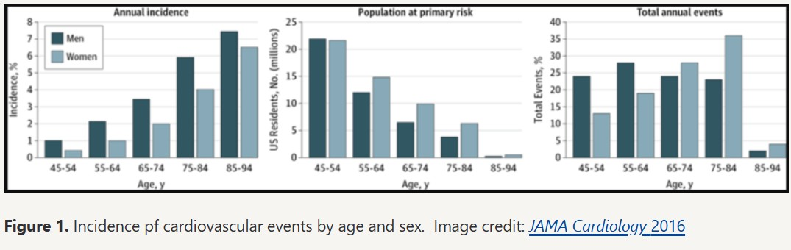

# Episode 203 - Ask Me Anything AMA #34 - What Causes Heart Disease?

## The importance of understanding atherosclerosis early in life

### Atherosclerosis is ubiquitous

It’s the only disease that is inevitable, and it limits human longevity. Cancer and dementia, also diseases of old age are not inevitable the way atherosclerosis is.
“Not everybody dies from atherosclerosis, but… everybody dies with it” — Peter Attia.
You want to understand this because the impact is huge and the tools we have are also huge. Extending lifespan comes down to delaying the onset of chronic disease, and atherosclerosis is the most common chronic disease.

### 2 main paths to atherosclerosis

Risk factors:

- Smoking, a behavioral risk factor (we’ll put this aside for the moment)

1. Hypertension
2. High blood and lipid abnormalities (we’ll focus on this one). This leads to atherosclerotic cardiovascular disease (ASCVD).

### Studies of pathology show ASCVD begins at a young age

What is the most common presentation for a 1st heart attack? Sudden death. A 1st heart attack in over 50% of people is fatal; today this number is a little less but still staggering. What is the age distribution of people who have their 1st major adverse cardiac event?

Adverse cardiac events are a heart attack or a stroke (or death). The figure below shows the incidence of cardiovascular events for both males and females in the US.

The graph on the right shows total annual events. The 1st 2 sets of bars show the number of events for people under 65. Men are shown in the darker bars comprising slightly below 25% and slightly above 25% of all cardiac events. The implication is that 50% of men who are going to have a cardiac event in their life will have it before the age of 65. For women, a third of women will have their 1st cardiac event before the age of 65. The total annual events is not the whole story; it’s important to understand how long it takes for this disease to take hold. Early prevention is key. Almost 25% of these events are in men younger than 54. When you think of someone who is 45, 50, this disease didn’t start 2 years beforeWhen you see these stats laid out, it creates a shift in your mind around why you should care about this.

### Defining atherosclerotic cardiovascular disease (ASCVD), its causes, and the role of cholesterol

ASCVD is disease state characterized by the deposition or the buildup of cholesterol (sterols) in the artery wall

It begins with a fatty streak that later consolidates into plaques that can ultimately lead to a reduction in blood flow. Reduction in blood flow is called ischemia. Ischemia results in tissue damage to the heart and this is what results in a heart attack. A heart attack can be fatal depending on the amount of cardiac tissue that is damaged from loss of oxygenation.

### Causes of ASCVD

You don’t have to be obese or have high blood pressure. It’s really a question of the cholesterol in your blood. Atherosclerosis is defined by the presence of cholesterol in the artery wall. This is not necessarily related to the measurement of cholesterol in circulation. Patients with cholesterol in their arteries do not necessarily have to have co-aggravating factors such as: high blood pressure, diabetes, obesity, family history, smoking. All these things that exacerbate ASCVD.

### Cholesterol explained

Cholesterol is an organic molecule, a type of lipid. It is not soluble in water. It is a hydrophobic molecule. Picture pouring oil into water and you would immediately see what it means to have a hydrophobic substance in contact with something that is hydrophilic (water). They repel each other. Cholesterol is about one of the most important molecules in the body. One would die without it. Rare genetic conditions that impair the ability to make cholesterol are fatal.

Cholesterol is used for 2 main things:

1. The cell membrane of every cell in the body contains cholesterol
   Cholesterol contributes to the fluidity of the cell membrane, important for membrane channels that allow things in and out of the cell.
2. Synthesis of many hormones begins with cholesterol, including: cortisol, estrogen, testosterone. It is also essential for the creation of bile acids, necessary to digest food.

### Where does cholesterol come from?

Most people think of cholesterol as something that comes from eating certain foods. This is true, eggs contain cholesterol. But the cholesterol in your bloodstream has little to do with the cholesterol in foods you eat. The reason is, the cholesterol we eat in esterified, it has a chemical bond that swings between an intermediary oxygen and another side chain. This cholesterol is too large for the receptors in our gut to absorb. Most of the cholesterol we eat is excreted. Most of the cholesterol we will discuss (in our bloodstream) is made in our body and transported between cells through lipoproteins.
