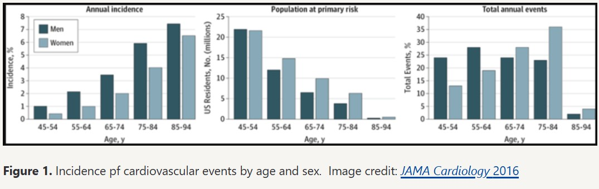

# Episode 229 - Understanding cardiovascular disease risk, cholesterol, and apoB

## Overview

Atherosclerotic cardiovascular disease (ASCVD) is ubiquitous and has a major impact on human longevity. While cancer and dementia are both prevalent with aging, they are not inevitable in the way that ASCVD appears to be. Understanding ASCVD is crucial because both its impact and our tools to address it are significant.

## Key Points

### The Ubiquity of ASCVD

- It has a major impact on human longevity
- Extending lifespan comes down to delaying the onset of chronic disease, and atherosclerosis is the most common chronic disease

### Main Risk Factors for Atherosclerosis

1. Hypertension (high blood pressure)
2. Lipid abnormalities (focus of this episode)
3. Smoking (behavioral risk factor)

### Early Onset and Fatal Consequences

- Studies of pathology show ASCVD begins at a young age
- The most common presentation for a 1st heart attack is sudden death
- A 1st heart attack in over 50% of people is fatal
- Early prevention is key

### Age Distribution of Cardiac Events

According to a 2016 study in JAMA Cardiology:

- 50% of men who will have a cardiac event in their life will have it before age 65
- About 1/3 of women will have their first cardiac event before age 65
- Almost 25% of these events are in men younger than 54

Source: [JAMA Cardiology 2016](https://jamanetwork.com/journals/jamacardiology/fullarticle/2523465)

## Importance of Early Prevention

When viewing these statistics, it becomes clear that ASCVD doesn't start just years before the event. For someone experiencing a cardiac event in their 40s or 50s, the disease process likely began decades earlier. This understanding should shift our perspective on early prevention.

## Clinical Implications

Understanding these patterns helps clinicians recognize the importance of early screening and intervention, especially in patients with family history or other risk factors for cardiovascular disease.

## Defining ASCVD

Atherosclerotic cardiovascular disease (ASCVD) is disease state characterized by the deposition or the buildup of cholesterol (sterols) in the artery wall

- It begins with a fatty streak that later consolidates into plaques that can ultimately lead to a reduction in blood flow
- Reduction in blood flow is called ischemia
- Ischemia results in tissue damage to the heart and this is what results in a heart attack
- A heart attack can be fatal depending on the amount of cardiac tissue that is damaged from loss of oxygenation

### Causes of ASCVD

- You don’t have to be obese or have high blood pressure
  “It’s really a question of the cholesterol in your blood. That’s really what defines the disease.”‒ Peter Attia
- Atherosclerosis is defined by the presence of cholesterol in the artery wall
  This is not necessarily related to the measurement of cholesterol in circulation.
- Patients with cholesterol in their arteries do not necessarily have to have co-aggravating factors such as: high blood pressure, diabetes, obesity, family history, smoking. All these things that exacerbate ASCVD.

### Cholesterol explained

- Cholesterol is an organic molecule, a type of lipid
- It is not soluble in water
- It is a hydrophobic molecule
- Picture pouring oil into water and you would immediately see what it means to have a hydrophobic substance in contact with something that is hydrophilic (water). They repel each other.

### Benefits of Cholesterol

Cholesterol at healthy levels, is about one of the most important molecules in the body

- You would die without it
- Rare genetic conditions that impair the ability to make cholesterol are fatal
  Cholesterol is used for 2 main things:
  1 – The cell membrane of every cell in the body contains cholesterol
  Cholesterol contributes to the fluidity of the cell membrane, important for membrane channels that allow things in and out of the cell
  2 – Synthesis of many hormones begins with cholesterol, including: cortisol, estrogen, testosterone
- It is also essential for the creation of bile acids, necessary to digest food

### Where does cholesterol come from?

- Most people think of cholesterol as something that comes from eating certain foods
- This is true, eggs contain cholesterol, but the cholesterol in your bloodstream has little to do with the cholesterol in foods you eat. The reason is, the cholesterol we eat in esterified, it has a chemical bond that swings between an intermediary oxygen and another side chain. This cholesterol is too large for the receptors in our gut to absorb. Most of the cholesterol we eat is excreted
- Most of the cholesterol we will discuss in our bloodstream is made in our body and transported between cells through lipoproteins

## Why early prevention of atherosclerosis is critical

- No doctor has more experience with what it is to have heart attacks than pathologists because 25 years ago, 50% of the people who have a heart attack die on their first heart attack.
- Today, approximately 1/3 of first events are fatal.
- There have been many autopsy sections of coronary arteries from people who had died for other reasons. These people were quite young, for example: a 26-year-old male victim of a gunshot wound or a 27-year-old female who died in a motor vehicle accident, etc. Looking at their coronary arteries, one realizes they already have atherosclerosis.

They have oxidized apoB-bearing particles engulfed by macrophages and thickened intima.
While they may not have calcification in their arteries yet or the types of plaque that would rupture within the ensuing weeks or days or months, they nevertheless had atherosclerosis.

## Preventing atherosclerosis in medicine today — two fatal flaws with the “10-Year Risk” approach

Atherosclerosis, it’s a disease in the tissue, yet almost everything that lipid people talk about is in plasma
One must understand the natural history of the disease to learn how to construct a strategy to prevent it
Although much of Allan’s work has been on apoB, the more important part has been on understanding how the natural history of atherosclerosis should direct a prevention strategy
What this leads to is that every major guideline in the world bases their selection of subjects for statin prevention on the 10-year risk of disease
This was a huge step forward in 1980 and 1990
But it fundamentally makes prevention of premature disease almost impossible

### Problems with the 10-year risk approach

When one plugs in the numbers to calculate a patient’s risk in any of the risk algorithms, one expects the output to be the patient’s risk of cardiovascular disease (CVD), but it isn’t. Typical calculations include:

- The American College of Cardiology ASCVD Risk Estimator Plus.
- The calculation is driven by the age and sex of the patient.
- Things like cholesterol and blood pressure contribute minimally to the actual calculation of ten-year risk.
  So if the patient is 35, there isn’t a risk calculator for them.
  If the patient is 40, everyone’s risk is low at age 40.
  It isn’t until age 55 or 60 that the risk gets over the threshold for the American Prevention Guideline treatment.

### So prevention really starts at 55 to 60, but almost half of all infarcts and strokes occur before the age of 60

Stary and colleagues established that for the first 3 decades or so of life, the disease gets a foothold in the artery, but it’s only in the 4th decade that one starts to develop the lesions that can actually precipitate a clinical event.
The risk is low, yet the event rate is high‒ How could that possibly be? Allan Scheinder says the answer is “stunningly obvious”‒ Allan has published on how this can be explained, there are 2 problems:

1. There are a ton more people under 60 than over 60
   So the rate of events is low, but the absolute number of events is high
2. Say a patient gets to their 60’s without a cardiac event, but the disease was developing and extending during their 30’s-50’s
   So by the time a doctor tries to prevent an event, the disease is well advanced in the arteries.
   These are the 2 fatal flaws in the 10-year risk approach:
3. Risk is a good concept but Allan realized doctors should be selecting people based on causes of CVD.
   For example, if someone's risk is 4.1%, what does this number mean?
   Is their risk 4.1%?  
   No, it means 4.1 people out of 100 will have an infarct
   But within this category, there is tremendous variance in real risk
   Not everyone is at 4.1; some are higher; some are lower; some are dead on.
   The philosopher AJ Ayer (known for logical positivism) was actually darn good on probability.
4. There’s a real challenge predicting singular events.
   One is either going to have an infarct in the next year or not; it’s not really a probability. If one algorithm said a patient has a 10% risk and another one said a patient has a 15% or 20%, whether they have an infarct or not, both algorithms were right because they said there was sort of a chance the patient would have an infarct
   There is also a far greater chance that the patient won’t have an infarct.
   When the advice is to treat patients with a risk abouve 7.5%, that means 92.5% of the time nothing will happen to these patients
   That’s not a great incentive for helping people understand what’s truly going to happen. A 30-year model of risk that focuses on cause of CVD.

What Allan Schneider has done is develop what’s called a causal benefit model.
Published in Clinical Science in 2012, The Causal Exposure Model of Vascular Disease
Published in JAMA Cardiology in 2017, The Benefit Model for Prevention of Cardiovascular Disease: An Opportunity to Harmonize Guidelines
With a measure of non-HDL or apoB, risk can be projected for over 20-30 years
For a 30-year-old, the period of time they should care about is up to at least 60
For example, this model could predict that a 35-year-old has a 30% chance of stroke before age 65.
“Now that’s a number you can deal with. That’s a number that has meaning.”‒ Allan Sniderman. Now a second calculation can be made to determine how much the risk can be reduced by starting treatment at age 35 or how much the patient would lose by starting at age 45 or age 55.

## Intro to lipids and lipoproteins: why there is no “bad” or “good” cholesterol

### What is cholesterol?

- Cholesterol is a lipid synthesized by every cell in our body
- Cholesterol is essential for creation of a cell
- In reality, cells are 3-dimensional and they are fluid
- The cell’s membrane (aka plasma membrane) give them that fluidity via the cholesterol in the membrane. This fluidity also allows transporters to go across the surface of cells. Transporters allow various things to traverse the membrane such as glucose, ions, hormones, etc.

### Why is cholesterol essential?

1. Cholesterol imparts fluidity to membranes
2. Cholesterol is the precursor for hormones (Vitamin D, Cortisol, Estrogen, Testosterone, Progesterone)
3. Cholesterol is essential for bile acids. We wouldn’t be able to digest our food without bile acids (especially fatty foods)

Why does the story not end here?

Not every cell in the body can make enough cholesterol to meet its own needs. So the body has to be able to traffic cholesterol. Some cells tend to be net exporters of cholesterol (like the liver). Some parts of the body cannot make enough cholesterol to meet their needs, especially during periods of high stress. These parts of the body need to receive cholesterol. This poses a problem because the circulatory system is the main way things are transported throughout the body (The lymphatic system is another system used for transport). Many things are transported in the circulatory system without difficulty (Glucose, Lactate, Electrolytes, All of these are water soluble).
The circulatory system (the blood) is made up of plasma (water) and proteins. Things that are water soluble are transported easily. Cholesterol is a lipid and not water soluble (hydrophilic). It is hydrophobic. Things that are hydrophobic cannot move in water. Think of dumping oil in water; they repel each other. We can’t move cholesterol directly through the circulatory system. The solution is to use a vehicle to transport cholesterol in the blood. This is a lipoprotein. A lipoprotein is part lipid and part protein. It is engineered so the lipid part is on the inside. The protein part is on the outside, and protein is water soluble. This is a spherical molecule which can package hydrophobic cargo on the inside. The outside is hydrophilic (attracted to water) and moves effortlessly through the circulatory system. Lipoproteins are how cholesterol is transported in the blood.

### Broadly speaking, these lipoproteins traffic in 2 families

1. A family defined by apoB, an apolipoprotein that wraps around the spherical, larger lipoprotein.
2. A family defined by apoA

Technically there are 2 apoB families, apoB-100 and apoB-48. We’ll ignore apoB-48 for now, it is only found on chylomicrons. ApoB-100 defines this lineage of lipoproteins (VLDL, IDL, LDL, Lp(a)). The ApoA lipoproteins define a totally different class of lipoproteins called HDL.

### What do these names mean? (VLDL, ILDL, LDL, HDL)

These names refer to another feature of the lipoprotein that is distinct from the apolipoprotein that wraps around them, their density
Think of a high school experiment‒ take different substances and see where they float in water
Water is a bad example because things tend to sink or float
But this provides a conceptual understanding of density
Density is mass over volume
A higher density object (relative to a lower density object) will sink (versus float)
If you take all of the lipoproteins and put them in a gel in the lab, you can see a separation based on their density

The highest density lipoproteins are called HDLs
There is more than 1 apoA on a HDL
There are different subclasses of HDLs
HDLs are really complicated
We don’t come close to understanding all the in’s and out’s of HDLs
This is why Peter gets really annoyed when people say, “Having a high good cholesterol is good”
What they mean is having a high HDL is good
While it’s true that on average higher HDL cholesterol is associated with and traffics with good metabolic health in a way that low HDL cholesterol traffics with bad metabolic health
You cannot tell if a person is in good shape or not by looking at their HDL level
That single snapshot of how much cholesterol is in the HDL tells you nothing about the functionality of the HDL
It’s the functionality of the HDL that matters
We’ll go into HDL biology in a future podcast
Efforts to raise HDL pharmacologically have mostly failed to improve outcomes

### More about LDL apoB

Low density lipoprotein (LDL) contains apoB.

The most abundant apoB-100 (or apoB for short) is the low density lipoprotein (LDL).
That’s the one that gets called bad cholesterol.
While on the apoA side, HDL is called the good cholesterol (high density lipoprotein).

If someone says, “What is your HDL? What is your LDL?” They’re asking for a laboratory metric, they’re asking incorrectly. There's technically no laboratory metric called LDL or HDL. There is HDL cholesterol and LDL cholesterol, abbreviated LDL-C and HDL-C. There’s LDL-P and HDL-P, which is the particle member of LDL, which can be counted via electrophoresis or NMR. The preferred way to count the number of these particles is to look at apoB.

The apoB concentration is the most important number you want to understand to predict from a biomarker standpoint your ASCVD risk, because it captures all of the atherogenic particles.

ApoB counts the total of the LDLs, inclusive of the Lp(a)s, the IDLs (although they virtually never exist, they have such a short residence time) and the VLDLs (which can become problematic in people with metabolic syndrome and high triglycerides). IDL's are short for Intermediate-density lipoproteins. VLDL's are short for Very-low-density lipoprotein.

ApoB gives you the total atherogenic burden of those lipoproteins… it’s the preferred metric by which we want to assess risk.

LDL as lipoproteins are bad actors because of what they do. LDL goes into artery walls and becomes oxidized. Then it dumps their oxidized sterol contents into the subendothelial space. This elicits an immune response and lots of other things that lead to atherosclerosis. The point here is to understand that HDL and LDL are lipoproteins, and if you want to talk about cholesterol, you talk about LDL cholesterol and HDL cholesterol. The cholesterol in them is exactly the same.\_3-columns

## Limitations of Standard Blood Panels

Doctors get a report of 5 numbers: total cholesterol, triglycerides, non-HDL-C, LDL-C, HDL-C.

What can they do with that? Everything is based on LDL
In reality, the other 4 numbers are doing nothing.

### Understanding the differences between calculated versus measured LDL, and amount of cholesterol versus number of particles

For example, a patient’s labs report 140 mg/dL LDL-C. This is an estimation; it’s almost always a calculation. There are at least 8 different methods to calculate LDL cholesterol. They don’t all give the same answer. LDL cholesterol can also be measured directly. That assay has never been validated in disease patients. No one has ever published a paper showing that it’s more accurate in terms of disease identification than calculated LDL cholesterol.

There’s no question that the number of LDL particles is a more accurate index of risk than the LDL cholesterol

- VLDL-C is a cholesterol that’s in the very low density lipoprotein particles. These particles that come out of the liver. This cholesterol is atherogenic, there’s a lot of triglyceride in that particle.
- High triglycerides ‒ there’s no question that people with high triglycerides are at increased risk of heart disease. The people with high triglycerides that are at increased risk of heart disease have a higher number of LDL particles and VLDL particles.
- When triglycerides are measured, what is measured is just measuring a blob of liquid in a bunch of particles, and one needs to know the number of them.
- Extremely high triglycerides carry an increased risk of pancreatitis.
- The evidence that triglycerides itself is pro-atherogenic is not strong. What’s atherogenic is the cholesterol inside the VLDL particles, it’s the number of those particles that get into the wall.

In general, all an indivdual needs to know to estimate CVD risk is the ApoB level, except for 1 complication, a disorder called remnant type III dysbetalipoproteinemia (or hyperlipoproteinemia). This is a very specific, highly atherogenic condition. It manifests with high triglycerides, high cholesterol, but low apoB. When lipids and apoB are measured, this disorder can be recognized. Doctors still do not routinely measure ApoB. If you don’t measure apoB, this condition cannot be diagnosed.

## How Mendelian randomization is bolstering the case for apoB as the superior metric for risk prediction

Will kids in med school 10 years from now be learning about apoB instead of LDL? Some physician specialists like Allan Sniderman are pessimistic. The 2019 European guidelines were very pro apoB. Allan adds, “The evidence from Mendelian randomization, the newer technologies, they’ve just been a slam dunk for apoB”.

Conventional studies are prospective observational studies (like the Framingham Heart Study). This is a conventional way of taking things apart. There’s a limited amount of certainty of the conclusions because of confounding that can’t be dealt with. This study takes measurements at age 20 and then follows someone for the next 30 years. A lot of things change in 30 years. The inferences are probable but not causal.

**Mendelian randomization** allows one to come a lot closer to causality. For example, one can identify groups of genes that are associated, where changes in the gene are associated with a little lower cholesterol or a little higher cholesterol. When one lumps together a bunch of those different genes that have different makeups, you can see fairly substantial differences in cholesterol. You have information on somebody that’s fixed at birth (genotype), and you see if that is associated with a difference in outcome. With Mendelian randomization, you’ve gotten rid of a lot of stuff in the middle. What a number of Mendelian randomization studies have shown is that apoB includes all the information in triglycerides, LDL cholesterol, and even HDL cholesterol; it sums them. George Davey Smith (one of the founders of Mendelian randomization) is the author of a number of Mendelian randomization studies says apoB incorporates and therefore beats triglycerides and LDL cholesterol. This is a huge level of information that isn’t even mentioned in almost any of the guidelines.

When following a cohort prospectively, the way the Framingham cohort was followed (or the Framingham offspring or the MESA cohort, or any of these cohorts have been followed), you can take a bunch of people and measure their apoB or their LDL-C or whatever metric, and you are trying to determine if it has a causal relationship to the disease of interest. This cohort can be followed over decades. It has been demonstrated that the people with higher apoB, higher LDL-C, higher non HDL-C, and lower HDL-C all have a higher risk of developing atherosclerosis over time. It’s hard to say that that’s causal just based on that information, because over the ensuing 20 years that you follow them, they are free to make other choices that may impact those variables of interest and other variables. The Mendelian randomization attempts to get around that by saying at the time of conception, we all get randomized to a set of genes. If one can identify which genes map to which phenotype (and one can figure out the genes that mapped to the phenotype of our interest, namely driving up or down a variable of interest such as apoB) then there’s no worry about the confounders that occur in between, because the genes can’t change. Now when a difference in outcome is observed, it’s much more likely to be causally related to the phenotype of interest because the gene that underlies it has not changed.

### What are some of the limitations of Mendelian randomization?

HDL cholesterol is popular because the epidemiological evidence couldn’t be clearer. The Framingham study, for example, demonstrated that low HDL-C was 4 times more predictive of cardiac events than high LDL-C. Allan Sniderman agrees that the difference is definitely multiples. Further it is known from CETP inhibitors, that one can’t manipulate HDL and change outcomes. That’s one of the elements of demonstrating an overall causal relationship.

### The Mendelian randomization shows HDL is not causal, whereas apoB and cholesterol are causal

In the past 10 years, it’s an incredible technical advance in being able to examine questions and look at numbers of people that would be unimaginable in conventional studies. The Mendelian randomization studies involve hundreds of thousands of people because they’ve got these huge data banks with genes and those numbers can avoid confounders. But it’s like any methodology, no method is perfect.
This one can mislead you too, particularly when you’ve got a sequence of associated variables. For example, people showed using Mendelian randomization (MR) that triglycerides were “causal” or “associated with increased risk”. But when one takes into account the non-HDL cholesterol or the apoB, the risk of triglycerides disappears. When there is a linked metabolic chain, one has to be careful to go to the end of it, to get to the real actor, not Act I leading… to get to the real personae dramatis. Peter Attia noted his surprise that HDL didn’t demonstrate causality (at least at the first order) because there’s no doubt that phenotypically, the high triglyceride, low HDL phenotype is so associated with metabolic syndrome. High triglyceride and low HDL make up 2 of the 5 criteria of metabolic syndrome
Allan Sniderman notes that HDL is an incomplete description. It’s like describing yourself as 6 feet tall, not telling the weight, and not asking about BMI. One might ask, “How can you pretend you’ve evaluated the system when you haven’t counted the number of atherogenic particles?” They could be normal, they could be high, or the patient could have a type III dysbetalipoproteinemia (or hyperlipoproteinemia). There is no phenotype without putting apoB in there.

### Is it true that smoking and hypertension probably carry a greater risk for atherosclerosis than apoB?

In terms of pathophysiology, the apoB bearing particle wreaks havoc in the artery wall many, many years before clinical events are observed. In the last 30 or 40 years there have been almost an infinite number of basic science studies on hypertension
Hypertension. is having higher blood pressure than what is normal. The drugs prescribed to treat hypertension work. But the understanding of what causes hypertension is not as well studied. Some believe hypertension arises from the loss of elastins in the proximal aorta, and that causes systolic hypertension. There is less literature on hypertension on peripheral arterial tone, complex metabolic studies in sophisticated animal models, as well as some renal studies.

### Involvement of the proximal aorta

The proximal aorta is elastic; if one looks at a flow curve (a hydrostatic pressure curve) when a patient is young it’s rounded because as the left ventricle ejects blood rapidly into the aorta, the aorta expands and absorbs some of that energy. Recall that wind castle that they’ve mentioned in school, but the energy is partially captured, partially regained; but the wall isn’t battered; the wall can give way. Imagine if those elastic fibers start to go, then the walls stiffen; now when the left ventricle ejects blood, the pressure goes up more rapidly and it falls more rapidly in diastole. This could be why systolic hypertension occurs while diastolic pressure is normal. Some studies suggest looking at factors like cardiac output again (which used to be studied way back when) or factors that alter the behavior of the proximal aorta. With hypertension there is a driving force to push particles into the wall. The wall thickens up and it gets harder for particles to go through. The response of the wall changes, and this leads to a the increase in blood pressure.

### Does it make sense to compare hypertension to apoB?

They both seem to play a causal role in CVD. Blood pressure tends to rise with age. Hypertension involves a large part of the population.
It seems that hypertension is becoming part of the aging process. Humans are lasting a lot longer than we were probably designed to. There is this repetitive injury to the proximal aorta, and it gets a little progressively less able to deal with it. So by the time a person is 50, somewhere around 60% have higher blood pressure.

### Does apoB rise with age?

It does rise with age, but not that much. If you have high apoB at age 35, you’ve got about a 95% chance of staying high; 5% will go out of the high zone but they won’t go low, low. This is why ApoB is a good signal for why when should start treating people. Some people go from low toward high, but the majority don’t. For people with high apoB, about 90% remain high.\_3-columns

### Is there a gender difference?

Peter has seen women experience dyslipidemia as they go through menopause. This is something men men wouldn’t experience over that same decade or even a 5-year transition. ApoB appears to go up with menopause but we may need more data on. The science has been held back because people don’t measure apoB.
